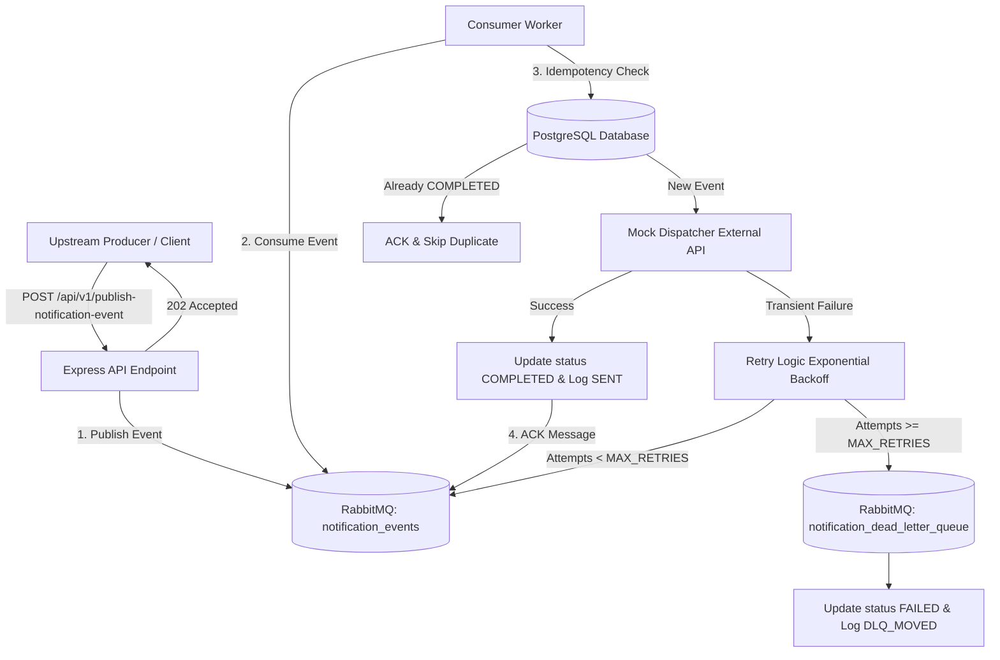

# Event-Driven Notification Service with RabbitMQ & Idempotency

Production-grade, highly reliable event-driven backend notification service built with Node.js, Express, PostgreSQL, and RabbitMQ. Features asynchronous message processing, database-level idempotency to prevent duplicate message execution, exponential backoff retry strategy, and a Dead-Letter Queue (DLQ) for permanent failure routing.

---

## Architecture Overview



---

## Core Features

- **Asynchronous Decoupling**: Accepts notification events via REST API and enqueues them immediately to RabbitMQ for non-blocking consumption.
- **Database-Level Idempotency**: Guarantees exactly-once processing per `event_id` using atomic transaction checks against `processed_events`.
- **Exponential Backoff Retries**: Automatically retries transient failures with scaling delays (`1s`, `5s`, `25s`).
- **Dead-Letter Queue (DLQ)**: Routes permanently failing events (after exhausting `MAX_RETRIES`) to `notification_dead_letter_queue` for investigation.
- **Audit Logging**: Persists complete event log history in `notification_logs` with statuses (`SENT`, `FAILED_EXTERNAL`, `DLQ_MOVED`).
- **Graceful Shutdown**: Intercepts `SIGTERM` and `SIGINT` to complete in-flight messages, unbind consumers, and close database/broker connections cleanly.
- **Automated Testing Suite**: Includes unit and integration test coverage for validation, idempotency, retries, and DLQ routing.

---

## Project Structure

```
.
├── src/
│   ├── api/
│   │   ├── routes.js           # API routes (POST /api/v1/publish-notification-event)
│   │   └── validator.js        # Request payload validation middleware
│   ├── config/
│   │   └── index.js            # Environment variable configuration loader
│   ├── consumer/
│   │   └── worker.js           # RabbitMQ consumption loop & message handler
│   ├── db/
│   │   └── index.js            # PostgreSQL connection pool & transaction helper
│   ├── queue/
│   │   └── rabbitmq.js         # RabbitMQ connection, queue assertions & pub/sub
│   ├── services/
│   │   ├── dispatcherService.js # External notification dispatcher simulator
│   │   ├── idempotencyService.js# DB atomic idempotency checks & audit logs
│   │   └── retryService.js     # Exponential backoff calculation & DLQ routing
│   └── app.js                  # Application entry point & graceful shutdown
├── tests/
│   ├── unit/                   # Unit test suite (validator, dispatcher, retry)
│   └── integration/            # Integration test suite (api, idempotency, dlq)
├── init-db/
│   └── init.sql                # Initial SQL schema script for Docker Compose
├── .env.example                # Example environment variable file
├── Dockerfile                  # Production container Dockerfile
├── docker-compose.yml          # Container orchestration (App, DB, Broker)
├── package.json                # Dependencies and test scripts
└── README.md                   # Service documentation
```

---

## Database Schema

### `processed_events` Table
Tracks processing state per `event_id` to guarantee idempotency.

| Column | Type | Constraints | Description |
| :--- | :--- | :--- | :--- |
| `event_id` | `VARCHAR(255)` | `PRIMARY KEY` | Unique event tracking UUID |
| `status` | `VARCHAR(50)` | `NOT NULL` | State: `PROCESSING`, `COMPLETED`, `FAILED` |
| `created_at` | `TIMESTAMP` | `DEFAULT CURRENT_TIMESTAMP` | Initial insert timestamp |
| `updated_at` | `TIMESTAMP` | `DEFAULT CURRENT_TIMESTAMP` | Last status update timestamp |

### `notification_logs` Table
Maintains audit trail of notification dispatch attempts.

| Column | Type | Constraints | Description |
| :--- | :--- | :--- | :--- |
| `log_id` | `SERIAL` | `PRIMARY KEY` | Auto-incrementing log ID |
| `event_id` | `VARCHAR(255)` | `FOREIGN KEY` | References `processed_events(event_id)` |
| `recipient` | `VARCHAR(255)` | `NOT NULL` | Recipient email / phone / target |
| `type` | `VARCHAR(50)` | `NOT NULL` | Event type e.g., `email`, `sms`, `push` |
| `message_payload` | `JSONB` | | Notification payload details |
| `status` | `VARCHAR(50)` | `NOT NULL` | Log status: `SENT`, `FAILED_EXTERNAL`, `DLQ_MOVED` |
| `processed_at` | `TIMESTAMP` | `DEFAULT CURRENT_TIMESTAMP` | Event processing timestamp |

---

## Getting Started

### Prerequisites
- Node.js (v18+)
- Docker & Docker Compose

### 1. Running with Docker Compose (Recommended)

Spin up PostgreSQL, RabbitMQ, and the Notification Service app simultaneously with healthy service dependency ordering:

```bash
docker-compose up --build -d
```

Service endpoints once running:
- **Notification API**: `http://localhost:8080`
- **RabbitMQ Management UI**: `http://localhost:15672` (Username: `guest`, Password: `guest`)
- **PostgreSQL**: `localhost:5432` (User: `user`, Pass: `password`, DB: `notifications`)

To stop all services:
```bash
docker-compose down
```

### 2. Local Environment Setup

1. Copy `.env.example` to `.env`:
   ```bash
   cp .env.example .env
   ```
2. Install dependencies:
   ```bash
   npm install
   ```
3. Run the application:
   ```bash
   npm start
   ```

---

## API Contract

### Publish Notification Event

**Endpoint**: `POST /api/v1/publish-notification-event`  
**Content-Type**: `application/json`

#### Request Body Example
```json
{
  "event_id": "b0b4a496-d245-4299-8d83-4a1801267592",
  "type": "email",
  "recipient": "user@example.com",
  "payload": {
    "subject": "Welcome!",
    "body": "Thanks for signing up."
  },
  "timestamp": "2026-08-15T10:00:00Z"
}
```

#### Response Success (202 Accepted)
```json
{
  "status": "accepted",
  "message": "Notification event accepted for processing",
  "event_id": "b0b4a496-d245-4299-8d83-4a1801267592"
}
```

#### Response Error (400 Bad Request)
```json
{
  "status": "error",
  "message": "Validation failed",
  "errors": [
    "Field \"recipient\" is required and must be a non-empty string"
  ]
}
```

---

## Simulating Failures & Retries

To simulate transient failures during testing or demoing:
- Send `recipient: "fail@example.com"` or payload `"simulate_failure": true`.
- The consumer will attempt dispatch, fail, and trigger exponential backoff retries (`1s`, `5s`, `25s`).
- Once `MAX_RETRIES` (default `3`) are exhausted, the event will automatically move to `notification_dead_letter_queue`, mark `processed_events` as `FAILED`, and insert a log entry with `DLQ_MOVED`.

---

## Running Automated Tests

Run unit and integration test suites:

```bash
npm test
```

Test Coverage includes:
- Payload validation middleware
- Mock dispatcher success and error simulation
- Exponential backoff delay math
- API route status responses
- Integration test for exactly-once processing (Idempotency)
- Integration test for retry exhaustion & DLQ routing